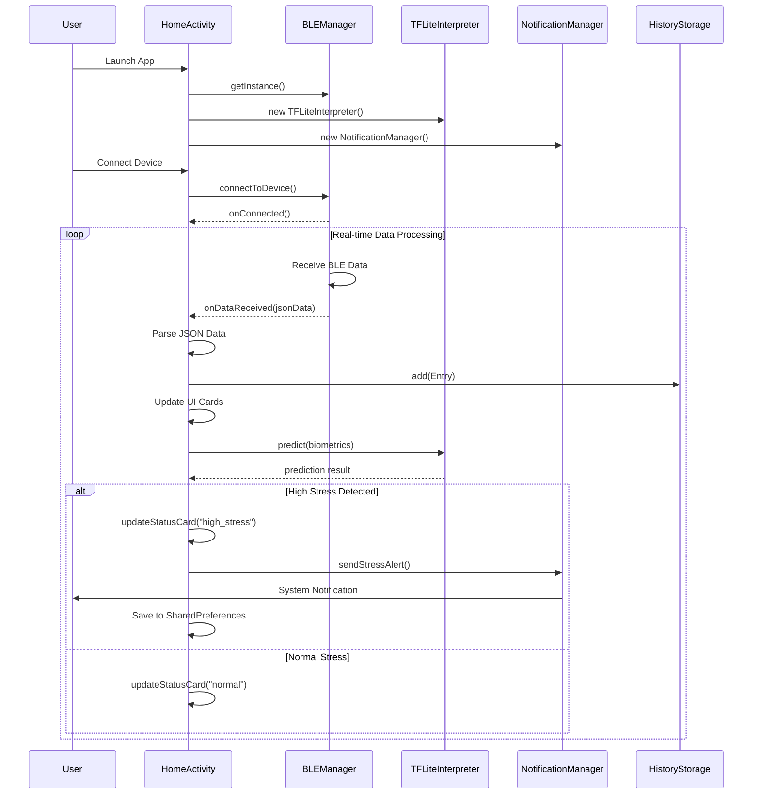
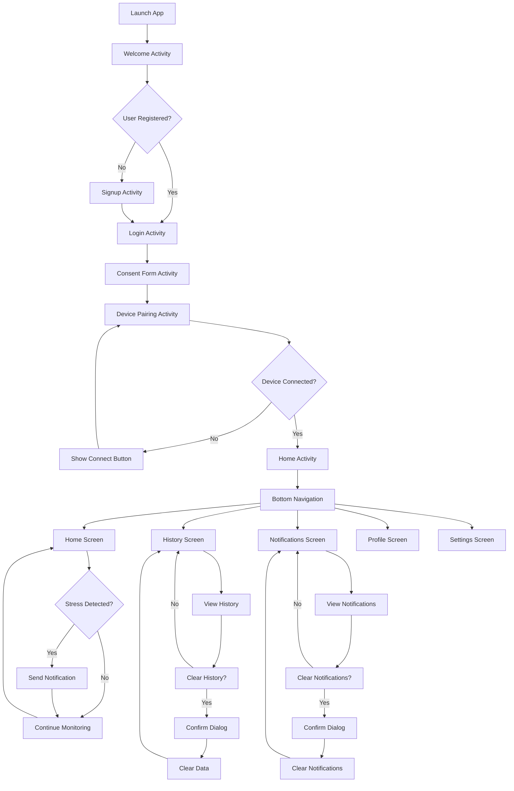
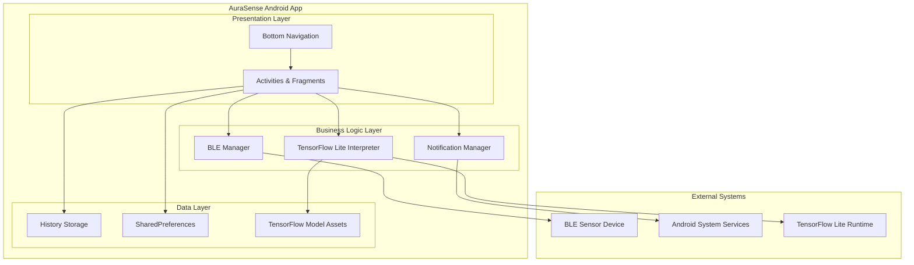
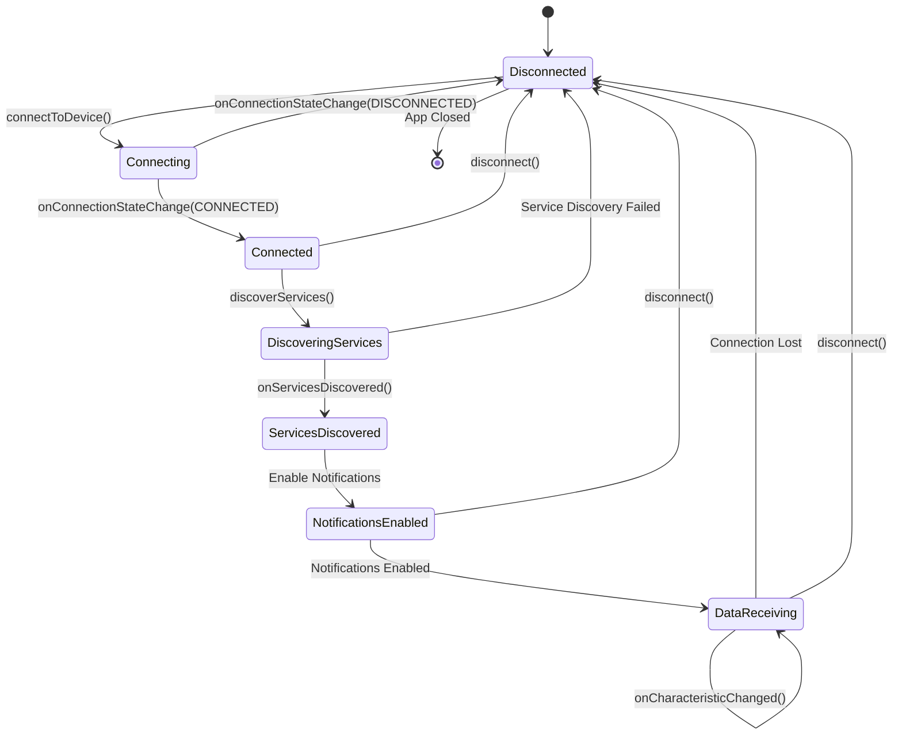
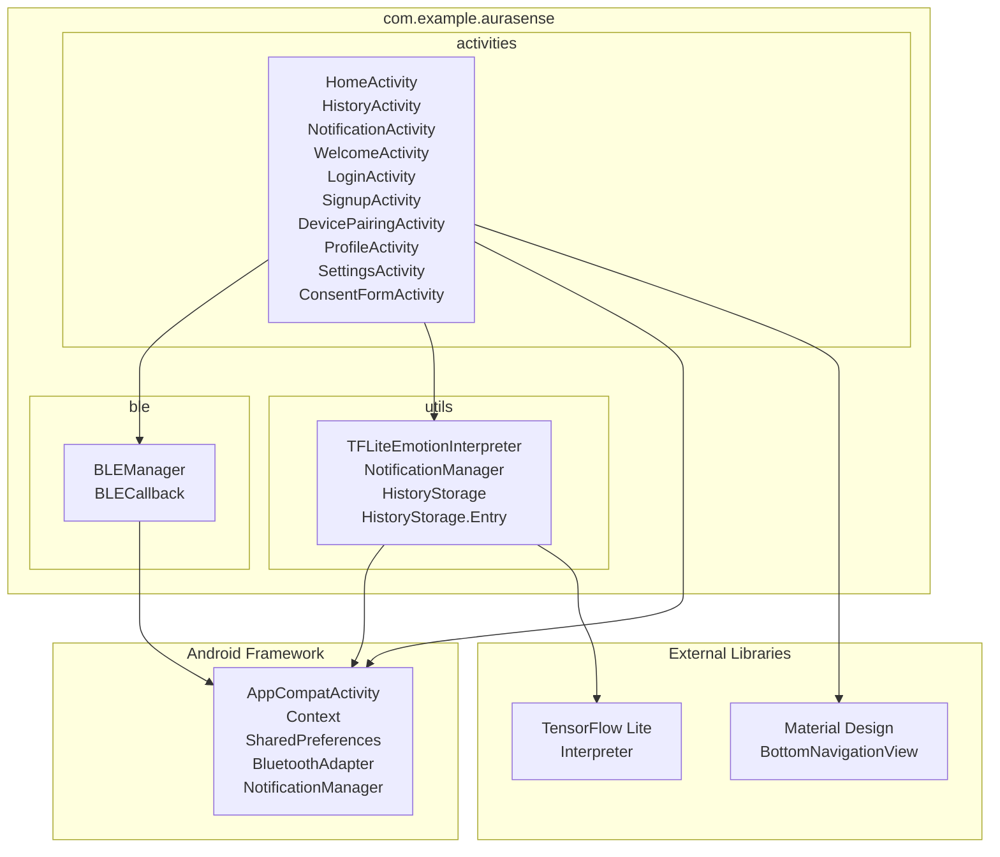

# AuraSense UML Diagrams

## 1. Class Diagram - Overall System Architecture

```mermaid
classDiagram
    %% Activities Package
    class HomeActivity {
        -TextView hrValue, tempCard, motionCard, debugRawJsonText
        -Button connectDeviceBtn
        -BLEManager bleManager
        -TFLiteEmotionInterpreter interpreter
        -NotificationManager notificationManager
        -boolean highStressTriggered
        -LinearLayout statusSummaryCard
        -ImageView statusIcon
        -TextView statusMessage
        +onCreate(Bundle)
        +onConnected()
        +onDisconnected()
        +onDataReceived(String)
        +onResume()
        -updateStatusCard(String, String)
    }

    class HistoryActivity {
        -ListView historyListView
        -Button clearHistoryBtn
        -TFLiteEmotionInterpreter interpreter
        +onCreate(Bundle)
        -loadHistory()
        -showClearHistoryDialog()
    }

    class NotificationActivity {
        -TextView notificationHistory
        -Button clearNotificationsBtn
        +onCreate(Bundle)
        -loadNotifications()
        -showClearNotificationsDialog()
    }

    class WelcomeActivity {
        +onCreate(Bundle)
    }

    class LoginActivity {
        +onCreate(Bundle)
    }

    class SignupActivity {
        +onCreate(Bundle)
    }

    class DevicePairingActivity {
        +onCreate(Bundle)
    }

    class ProfileActivity {
        +onCreate(Bundle)
    }

    class SettingsActivity {
        +onCreate(Bundle)
    }

    class ConsentFormActivity {
        +onCreate(Bundle)
    }

    %% BLE Package
    class BLEManager {
        <<Singleton>>
        -static BLEManager instance
        -Context context
        -BLECallback callback
        -BluetoothAdapter bluetoothAdapter
        -BluetoothGatt bluetoothGatt
        -StringBuilder bleBuffer
        +static getInstance(Context, BLECallback) BLEManager
        +setCallback(BLECallback)
        +connectToDevice(BluetoothDevice)
        +disconnect()
        -BluetoothGattCallback gattCallback
    }

    class BLECallback {
        <<interface>>
        +onConnected()
        +onDisconnected()
        +onDataReceived(String)
    }

    %% Utils Package
    class TFLiteEmotionInterpreter {
        -static String TAG
        -static String MODEL_NAME
        -Interpreter interpreter
        +TFLiteEmotionInterpreter(Context)
        -loadModelFile(Context) MappedByteBuffer
        +predict(float, float, float, float, float, float, float) int
        +close()
    }

    class NotificationManager {
        -static String CHANNEL_ID
        -static String CHANNEL_NAME
        -static String CHANNEL_DESCRIPTION
        -static int NOTIFICATION_ID
        -Context context
        -android.app.NotificationManager notificationManager
        -Vibrator vibrator
        +NotificationManager(Context)
        -createNotificationChannel()
        +sendStressAlert(float, String)
        -vibrateDevice()
        +cancelStressAlert()
    }

    class HistoryStorage {
        <<Utility>>
        -static List~Entry~ history
        +static add(Entry)
        +static getHistory() List~Entry~
        +static clearHistory()
    }

    class Entry {
        +final long timestamp
        +final float bpm, temp, hrv, accX, accY, accZ, accMag
        +Entry(long, float, float, float, float, float, float, float)
    }

    %% Relationships
    HomeActivity ..|> BLECallback : implements
    HomeActivity --> BLEManager : uses
    HomeActivity --> TFLiteEmotionInterpreter : uses
    HomeActivity --> NotificationManager : uses
    HomeActivity --> HistoryStorage : uses

    HistoryActivity --> HistoryStorage : uses
    HistoryActivity --> TFLiteEmotionInterpreter : uses

    BLEManager --> BLECallback : notifies
    BLEManager ..> HomeActivity : callback

    HistoryStorage --> Entry : contains
    Entry --* HistoryStorage : composition

    NotificationManager --> HomeActivity : launches via Intent

    %% Android Framework Dependencies
    HomeActivity --|> AppCompatActivity : extends
    HistoryActivity --|> AppCompatActivity : extends
    NotificationActivity --|> AppCompatActivity : extends
    WelcomeActivity --|> AppCompatActivity : extends
    LoginActivity --|> AppCompatActivity : extends
    SignupActivity --|> AppCompatActivity : extends
    DevicePairingActivity --|> AppCompatActivity : extends
    ProfileActivity --|> AppCompatActivity : extends
    SettingsActivity --|> AppCompatActivity : extends
    ConsentFormActivity --|> AppCompatActivity : extends
```



## 2. Sequence Diagram - Stress Detection Flow



## 3. Activity Diagram - User Navigation Flow



## 4. Component Diagram - System Architecture



## 5. State Diagram - BLE Connection States



## 6. Use Case Diagram - User Interactions

```mermaid
graph LR
    subgraph "AuraSense System"
        UC1[Monitor Stress Levels]
        UC2[View Historical Data]
        UC3[Receive Stress Alerts]
        UC4[Connect BLE Device]
        UC5[Manage Notifications]
        UC6[Clear History]
        UC7[User Authentication]
    end

    subgraph "Actors"
        USER[User]
        SENSOR[BLE Sensor]
        SYSTEM[Android System]
    end

    USER --> UC1
    USER --> UC2
    USER --> UC3
    USER --> UC4
    USER --> UC5
    USER --> UC6
    USER --> UC7

    SENSOR --> UC1
    SENSOR --> UC4

    SYSTEM --> UC3
    SYSTEM --> UC5

    UC1 --> UC3 : triggers
    UC1 --> UC2 : stores data for
```

## 7. Package Diagram - Code Organization



## Key Design Patterns Used

### 1. Singleton Pattern

- **BLEManager**: Ensures single instance for BLE connection management

### 2. Observer Pattern

- **BLECallback Interface**: Allows activities to observe BLE events
- **Bottom Navigation**: Activities observe navigation events

### 3. Strategy Pattern

- **TFLiteEmotionInterpreter**: Encapsulates stress prediction algorithm

### 4. Factory Pattern

- **NotificationManager**: Creates different types of notifications

### 5. Repository Pattern

- **HistoryStorage**: Provides abstraction for data storage operations

## Architecture Highlights

### 📱 **Presentation Layer**

- Multiple Activities with consistent Bottom Navigation
- Material Design components and custom styling
- Real-time UI updates based on sensor data

### 🧠 **Business Logic Layer**

- BLE communication management
- AI-powered stress detection using TensorFlow Lite
- Smart notification system with user preferences

### 💾 **Data Layer**

- In-memory history storage with static collections
- SharedPreferences for notification history
- TensorFlow Lite model assets

### 🔗 **Integration Layer**

- Android Bluetooth APIs for sensor communication
- Android Notification System for alerts
- TensorFlow Lite runtime for AI inference

This architecture provides a clean separation of concerns, making the codebase maintainable and extensible for future enhancements.
